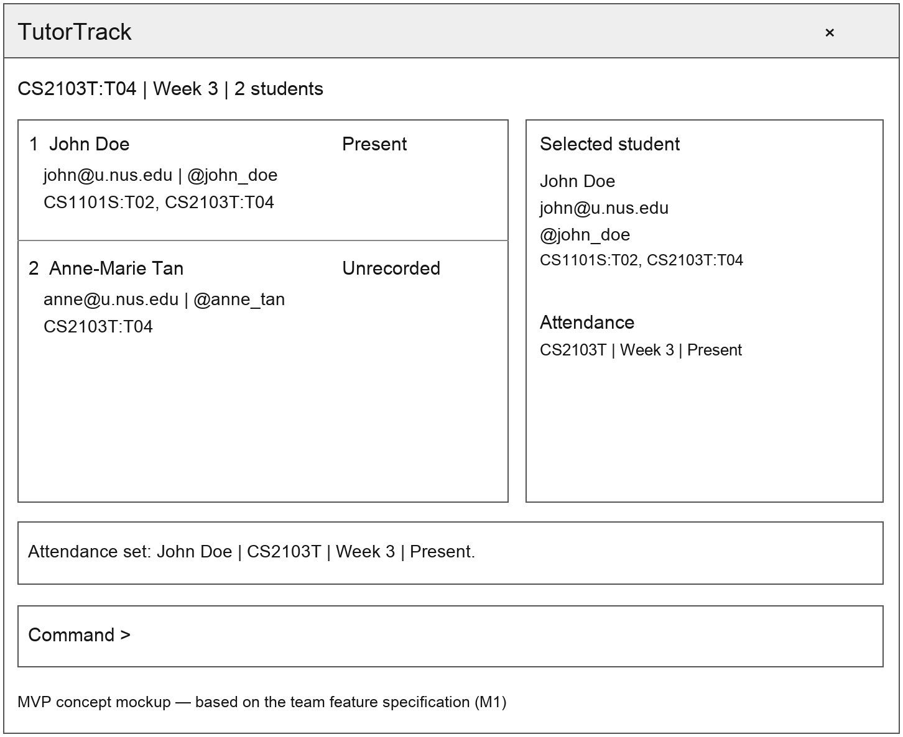

# TutorTrack

TutorTrack is a desktop application being developed for teaching assistants and professors who
prefer typing to manage student contact details, course memberships and weekly
attendance in one place.

*Planned MVP interface, adapted from the team feature specification (M1).
The mockup uses sample data and does not depict the current release.*

TutorTrack aims to help teaching assistants:

* Find and update student contact details quickly.
* Organize students by the courses they attend.
* Record and review weekly attendance alongside each student's details.

The project is currently in its documentation and planning iteration. Course and
attendance features are planned; the current implementation inherits AB3's
contact-management functionality.

Visit the [project website](https://ay2627s1-cs2103t-w08-4.github.io/tp/) for the
[User Guide](https://ay2627s1-cs2103t-w08-4.github.io/tp/UserGuide.html),
[Developer Guide](https://ay2627s1-cs2103t-w08-4.github.io/tp/DeveloperGuide.html), and
[team information](https://ay2627s1-cs2103t-w08-4.github.io/tp/AboutUs.html).

This project is based on the AddressBook-Level3 project created by the
[SE-EDU initiative](https://se-education.org).
