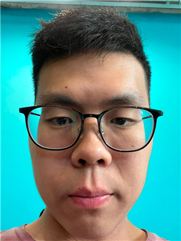

We are a team based in the [School of Computing, National University of Singapore](https://www.comp.nus.edu.sg).

## Project team

### Vincent Peh

[[github](https://github.com/Eskalade)]

* Role: Developer
* Responsibilities: Documentation (README, website and Developer Guide)

### Ethan Quek

[[github](https://github.com/eatenquek)]

* Role: Developer
* Responsibilities: GUI and testing

### Jian Yang

[[github](https://github.com/jianyang999)]

* Role: Developer
* Responsibilities: Code quality

### Min Thi Ha

[[github](https://github.com/toomintyy)]

* Role: Developer
* Responsibilities: Integration and releases — monitor CI, coordinate integration after peer review, and verify release packaging and readiness.
